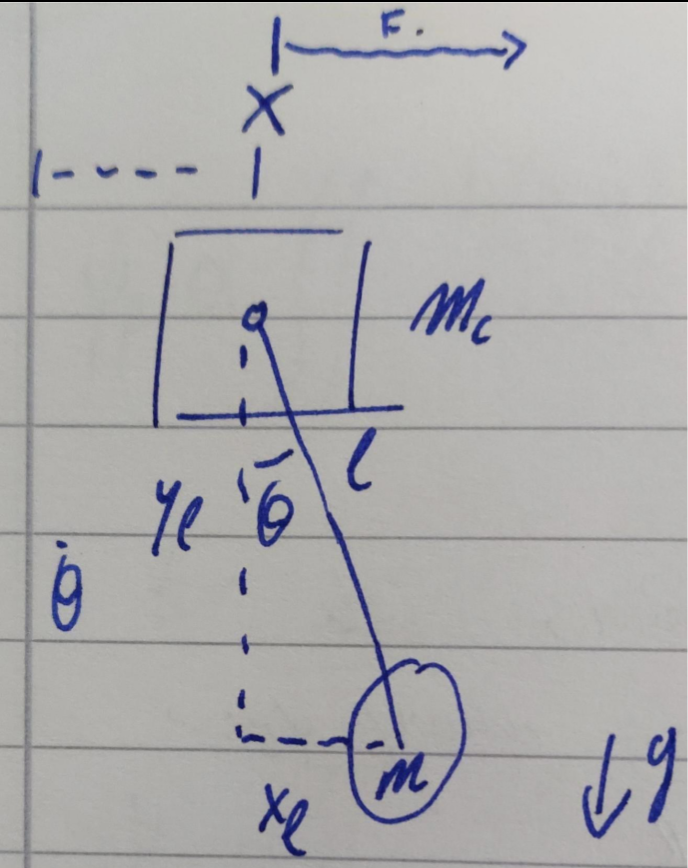

# cPendulum
Cart-Pendulum driver software for a proposed practical in part I of the Natural Sciences Tripos (Physical) at the Cavendish Laboratories at the Cambridge University Department of Physics.

<dl>
  <dt>Assembly Required</dt>
    <dd>The software contained within this repository was designed to drive and read data from a 3D-printed gantry onto which a pendulum is mounted. The gantry is belt-driven by an Arduino-controlled stepper motor, and the pendulum is fitted with a digital angle transducer. The cart rails are fitted with limit switches to prevent destructive encounters between the cart and the railheads. For more information, see Lucy's document on assembly and materials required.
  <dt>Arduino and Stepper Motor</dt>
    <dd>The Arduino interfaces with the stepper motor using a standard driver board, purchased alongside the motor itself. A high current power supply is required to run the driver and motor, and we've used a breadboard to make connections between the Arduino and all periphery, such as the limit switches and the driver board.</dd>
  <dt>Serial and Python Scripts</dt>
  <dd>dataextractor.py is the Python script that enables the collection of .csv files created by frequencysweep.ino. These files are processed by sweepgrapher.py to show oscillations of the cart and pendulum over time, as well as plot the frequency dependent response function of the oscillator. In a practical setting, an objective may be to use the graphs returned by sweepgrapher.py to find the quality factor of the oscillator, or to change parameters of the pendulum (such as the effective length by moving masses around) to see which aspects of the response function are affected. One must note that dataextractor.py does not always format the header correctly and therefore the file should always be checked before attempting to run with sweepgrapher.py</dd>
  <dt>Sample Data</dt>
    <dd>This repository contains a handful of .csv files which were collected using PuTTY, but should look and behave identically to those generated by dataextractor.py. They may be used for testing/configuration purposes.</dd>
  <dt>Required Packages and Libraries</dt>
    <ul>
      For Python:
      <li>Pandas</li>
      <li>Matplotlib</li>
      <li>Numpy</li>
      <li>Scipy.optimise</li>
       
      For Arduino:
      <li>Stepper.h</li>
      <li>Accelstepper.h</li>
      <li>AS5600.h</li>
    </ul>
</dl>

<h1>Mathematical motivation</h1>

